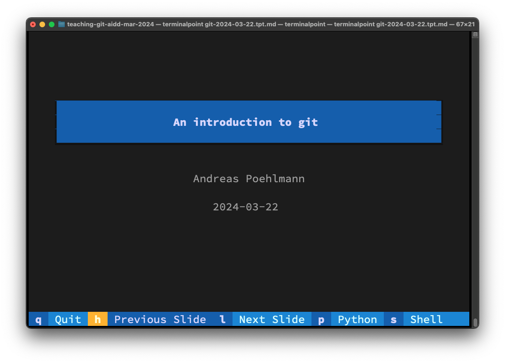

# An introduction to git

Hello everyone :wave:

This repository contains my presentation for "An introduction to git" talk of the
AIDD Project's ([Advanced Machine Learning for Innovative Drug Discovery](https:/ai-dd.eu))
School in March 2024.

### "That's not a power-point presentation Andreas?!?"

I presented this talk using a tool I wrote: [terminalpoint](https://github.com/ap--/terminalpoint).
It's supposed to look like this:


To view the presentation, you can install `terminalpoint` via pipx and then run
it on this file:

```bash
$ pipx install terminalpoint
$ terminalpoint git-2024-03-22.tpt.md
```

### Live Session

The live session will happen on Friday 2024-03-22 10:00h.

### Contribute

If you find mistakes, have questions or want to connect, just open an issue
in the repository :heart:
